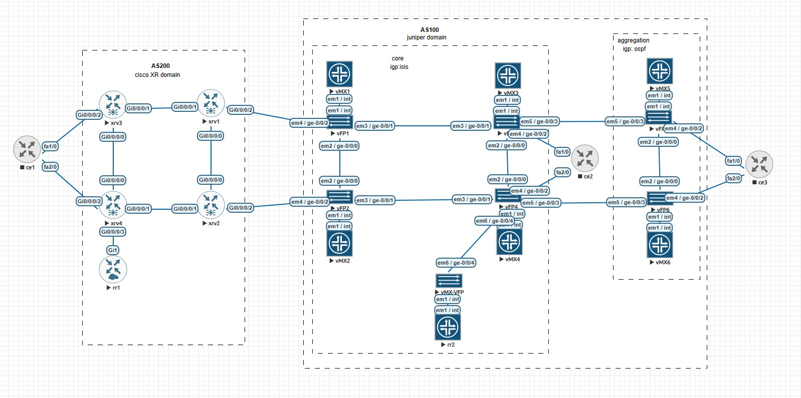

```
summary:
reachability inside the vrf A is ok between cisco xr and vmx domain is ok
vmx domain is seemless mpls, core (isis) and aggregation (ospf) with no redistribution between them.
towards aggregation endpoints bgp will transport labels
core ASBRs are bgp rrs towards the aggregation. :)
```

```

RP/0/RP0/CPU0:xrv4#sh route vrf A
Thu Nov 27 21:26:19.708 UTC

Codes: C - connected, S - static, R - RIP, B - BGP, (>) - Diversion path
       D - EIGRP, EX - EIGRP external, O - OSPF, IA - OSPF inter area
       N1 - OSPF NSSA external type 1, N2 - OSPF NSSA external type 2
       E1 - OSPF external type 1, E2 - OSPF external type 2, E - EGP
       i - ISIS, L1 - IS-IS level-1, L2 - IS-IS level-2
       ia - IS-IS inter area, su - IS-IS summary null, * - candidate default
       U - per-user static route, o - ODR, L - local, G  - DAGR, l - LISP
       A - access/subscriber, a - Application route
       M - mobile route, r - RPL, t - Traffic Engineering, (!) - FRR Backup path

Gateway of last resort is not set

B    11.11.11.1/32 [200/0] via 1.1.1.1 (nexthop in vrf default), 00:16:45
B    11.11.11.2/32 [200/0] via 1.1.1.2 (nexthop in vrf default), 00:16:36
L    11.11.11.4/32 is directly connected, 00:18:44, Loopback100
B    12.12.12.1/32 [200/0] via 1.1.1.2 (nexthop in vrf default), 00:16:36
B    12.12.12.2/32 [200/0] via 1.1.1.2 (nexthop in vrf default), 00:16:36
B    12.12.12.3/32 [200/0] via 1.1.1.2 (nexthop in vrf default), 00:16:36
B    12.12.12.4/32 [200/0] via 1.1.1.2 (nexthop in vrf default), 00:16:36
B    12.12.12.5/32 [200/0] via 1.1.1.2 (nexthop in vrf default), 00:16:36
B    12.12.12.6/32 [200/0] via 1.1.1.2 (nexthop in vrf default), 00:16:36

RP/0/RP0/CPU0:xrv4# ping vrf A 12.12.12.1
Fri Nov 28 18:35:12.497 UTC
Type escape sequence to abort.
Sending 5, 100-byte ICMP Echos to 12.12.12.1, timeout is 2 seconds:
!!!!!
Success rate is 100 percent (5/5), round-trip min/avg/max = 3/6/12 ms
RP/0/RP0/CPU0:xrv4# ping vrf A 12.12.12.2
Fri Nov 28 18:35:14.534 UTC
Type escape sequence to abort.
Sending 5, 100-byte ICMP Echos to 12.12.12.2, timeout is 2 seconds:
!!!!!
Success rate is 100 percent (5/5), round-trip min/avg/max = 1/2/3 ms
RP/0/RP0/CPU0:xrv4# ping vrf A 12.12.12.3
Fri Nov 28 18:35:15.943 UTC
Type escape sequence to abort.
Sending 5, 100-byte ICMP Echos to 12.12.12.3, timeout is 2 seconds:
!!!!!
Success rate is 100 percent (5/5), round-trip min/avg/max = 3/3/4 ms
RP/0/RP0/CPU0:xrv4# ping vrf A 12.12.12.4
Fri Nov 28 18:35:16.975 UTC
Type escape sequence to abort.
Sending 5, 100-byte ICMP Echos to 12.12.12.4, timeout is 2 seconds:
!!!!!
Success rate is 100 percent (5/5), round-trip min/avg/max = 2/2/3 ms
RP/0/RP0/CPU0:xrv4# ping vrf A 12.12.12.5
Fri Nov 28 18:35:17.885 UTC
Type escape sequence to abort.
Sending 5, 100-byte ICMP Echos to 12.12.12.5, timeout is 2 seconds:
!!!!!
Success rate is 100 percent (5/5), round-trip min/avg/max = 3/4/6 ms
RP/0/RP0/CPU0:xrv4# ping vrf A 12.12.12.6
Fri Nov 28 18:35:18.757 UTC
Type escape sequence to abort.
Sending 5, 100-byte ICMP Echos to 12.12.12.6, timeout is 2 seconds:
!!!!!
Success rate is 100 percent (5/5), round-trip min/avg/max = 3/3/4 ms
RP/0/RP0/CPU0:xrv4# ping vrf A 11.11.11.1
Fri Nov 28 18:35:27.159 UTC
Type escape sequence to abort.
Sending 5, 100-byte ICMP Echos to 11.11.11.1, timeout is 2 seconds:
!!!!!
Success rate is 100 percent (5/5), round-trip min/avg/max = 6/10/16 ms
RP/0/RP0/CPU0:xrv4# ping vrf A 11.11.11.2
Fri Nov 28 18:35:28.437 UTC
Type escape sequence to abort.
Sending 5, 100-byte ICMP Echos to 11.11.11.2, timeout is 2 seconds:
!!!!!
Success rate is 100 percent (5/5), round-trip min/avg/max = 1/1/2 ms
RP/0/RP0/CPU0:xrv4# ping vrf A 11.11.11.3
Fri Nov 28 18:35:29.518 UTC
Type escape sequence to abort.
Sending 5, 100-byte ICMP Echos to 11.11.11.3, timeout is 2 seconds:
!!!!!
Success rate is 100 percent (5/5), round-trip min/avg/max = 2/3/4 ms
RP/0/RP0/CPU0:xrv4# ping vrf A 11.11.11.4
Fri Nov 28 18:35:30.567 UTC
Type escape sequence to abort.
Sending 5, 100-byte ICMP Echos to 11.11.11.4, timeout is 2 seconds:
!!!!!
Success rate is 100 percent (5/5), round-trip min/avg/max = 1/1/1 ms
RP/0/RP0/CPU0:xrv4#

```


