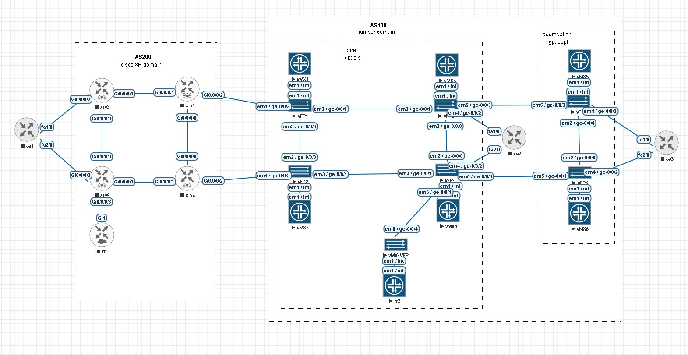

only juniper vmxs are running, investigating vrf and l2circuit reachability between core and aggregation

summary:
if bgp ipv4 unicast is ok between core and aggregation vrf ping and l2circuits are ok, if this path break somewhere (no bgp labels ipv4 unicast...), 
ping still works, but l2circuits go down.
`
if ok:
root@vmx1> show l2circuit connections 
Layer-2 Circuit Connections:

Legend for connection status (St) 
EI -- encapsulation invalid      NP -- interface h/w not present 
MM -- mtu mismatch               Dn -- down 
EM -- encapsulation mismatch     VC-Dn -- Virtual circuit Down 
CM -- control-word mismatch      Up -- operational 
VM -- vlan id mismatch           CF -- Call admission control failure
OL -- no outgoing label          IB -- TDM incompatible bitrate 
NC -- intf encaps not CCC/TCC    TM -- TDM misconfiguration 
BK -- Backup Connection          ST -- Standby Connection
CB -- rcvd cell-bundle size bad  SP -- Static Pseudowire
LD -- local site signaled down   RS -- remote site standby
RD -- remote site signaled down  HS -- Hot-standby Connection
XX -- unknown

Legend for interface status 
Up -- operational 
Dn -- down 
Neighbor: 1.1.56.5 
    Interface                 Type  St     Time last up          # Up trans
    ge-0/0/4.0(vc 15)         rmt   Up     Dec  2 20:21:51 2025           1
      Remote PE: 1.1.56.5, Negotiated control-word: Yes (Null)
      Incoming label: 17, Outgoing label: 17
      Negotiated PW status TLV: No
      Local interface: ge-0/0/4.0, Status: Up, Encapsulation: ETHERNET
      Flow Label Transmit: No, Flow Label Receive: No

root@vmx1> 

after
root@vmx1# deactivate protocols bgp group RR family inet labeled-unicast

[edit]
root@vmx1# show | compare 
[edit protocols bgp group RR family inet]
!        inactive: labeled-unicast { ... }

root@vmx1> show l2circuit connections 
Layer-2 Circuit Connections:

Legend for connection status (St) 
EI -- encapsulation invalid      NP -- interface h/w not present 
MM -- mtu mismatch               Dn -- down 
EM -- encapsulation mismatch     VC-Dn -- Virtual circuit Down 
CM -- control-word mismatch      Up -- operational 
VM -- vlan id mismatch           CF -- Call admission control failure
OL -- no outgoing label          IB -- TDM incompatible bitrate 
NC -- intf encaps not CCC/TCC    TM -- TDM misconfiguration 
BK -- Backup Connection          ST -- Standby Connection
CB -- rcvd cell-bundle size bad  SP -- Static Pseudowire
LD -- local site signaled down   RS -- remote site standby
RD -- remote site signaled down  HS -- Hot-standby Connection
XX -- unknown

Legend for interface status 
Up -- operational 
Dn -- down 
Neighbor: 1.1.56.5 
    Interface                 Type  St     Time last up          # Up trans
    ge-0/0/4.0(vc 15)         rmt   VC-Dn  -----                          1
      Remote PE: 1.1.56.5, Negotiated control-word: Yes (Null)
      Incoming label: 17, Outgoing label: 17
      Negotiated PW status TLV: No
      Local interface: ge-0/0/4.0, Status: Up, Encapsulation: ETHERNET
      Flow Label Transmit: No, Flow Label Receive: No

ping still works in the vrf 
root@vmx1> ping rapid routing-instance A 12.12.12.1 
PING 12.12.12.1 (12.12.12.1): 56 data bytes
!!!!!
--- 12.12.12.1 ping statistics ---
5 packets transmitted, 5 packets received, 0% packet loss
round-trip min/avg/max/stddev = 0.008/0.021/0.069/0.024 ms

root@vmx1> ping rapid routing-instance A 12.12.12.2 
PING 12.12.12.2 (12.12.12.2): 56 data bytes
!!!!!
--- 12.12.12.2 ping statistics ---
5 packets transmitted, 5 packets received, 0% packet loss
round-trip min/avg/max/stddev = 1.018/1.301/1.502/0.179 ms

root@vmx1> ping rapid routing-instance A 12.12.12.3 
PING 12.12.12.3 (12.12.12.3): 56 data bytes
!!!!!
--- 12.12.12.3 ping statistics ---
5 packets transmitted, 5 packets received, 0% packet loss
round-trip min/avg/max/stddev = 1.081/1.281/1.429/0.135 ms

root@vmx1> ping rapid routing-instance A 12.12.12.4 
PING 12.12.12.4 (12.12.12.4): 56 data bytes
!!!!!
--- 12.12.12.4 ping statistics ---
5 packets transmitted, 5 packets received, 0% packet loss
round-trip min/avg/max/stddev = 1.877/2.171/2.409/0.188 ms

root@vmx1> ping rapid routing-instance A 12.12.12.5 
PING 12.12.12.5 (12.12.12.5): 56 data bytes
!!!!!
--- 12.12.12.5 ping statistics ---
5 packets transmitted, 5 packets received, 0% packet loss
round-trip min/avg/max/stddev = 1.962/2.790/5.188/1.205 ms

root@vmx1> ping rapid routing-instance A 12.12.12.6 
PING 12.12.12.6 (12.12.12.6): 56 data bytes
!!!!!
--- 12.12.12.6 ping statistics ---
5 packets transmitted, 5 packets received, 0% packet loss
round-trip min/avg/max/stddev = 2.483/2.789/3.034/0.185 ms

`

